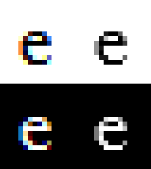
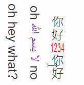

# text rendering

## Terminology

Characters:

* Scalar: Unicode Scalar, "smallest unit" described by unicode
  * also called a code point
* Character: Unicode Extended Grapheme Cluster (EGC), "biggest unit" described by Unicode
  * can be composed of multiple scalars
* Glyph: Atomic unit of rendering yielded by a font
  * will have unique ID (typically)
* Ligature: Glyph made up of several scalars or characters (to the font it's considered one character)
  * native speakers of a language may or may not think of ligatures as "muliple characters" and instead as individually unique characters
* Emoji: "Full color" glyph

Fonts:

* Font: Document that maps characters to glyphs
* Script: Set of glyphs that make up a language (alphabets)
* Cursive script: Scripts where glyphs flow (Arabic)
* Color: RGB/ Alpha values for fonts
* Style: Bold/ Italics modifiers for fonts
  * hinting/ aliasing settings also get stuffed in here usually

## Style, Layout, Shape

### Typical Text-Rendering Pipeline

1. Parse markup, query for fonts (**styling**)&#x20;
2. Break text into lines (**layout**)
3. Compute glyphs in a line and determine positions (**shaping**)
4. Rasterize glyphs into atlus/ cache (**rasterization**)
5. Copy glyphs from atlus to computed shaping (**composition**)

#### Where It Breaks

Fonts don't typically provide glyphs for all characters in every script in every langauge. Systems make up for it by cascading into other fonts when characters aren't available in the chosen font.

Example: hello 😺 मनीष بسم 好 (requires multiple fonts)

The example perhaps requires the styling portion to rely on the shaping portion (consider the cursive script) which sucks.

Layout step also requires knowing how much space each character will take (i.e. shaping) while shaping also depends on the other 2.

#### How It Works

Styling gets to cheat: styling only asks for scalars. For every EGC in text, ask each font in the cascade if it knows about each scalar that makes up that character, then use that character if it does. If nothing found by end of cascade, use tofu: 󿿽 aka the missing glyph indicator.

Some emojis are ligatures of previous emojis hence why things like differing skin color emojis can break if fonts are "too old" to know about those characters. (e.g. 🤦🏿‍♀️ appears as 🤦 🏿‍ ♀)

Shaping and layout are done iteratively for each line: assume text fits on single line and then shape it until there's no more space, then perform layout ops and determine where to break the line on that text and start new line, then start over.

## Text Isn't Individual Characters

For scripts like Arabic, you cannot correctly draw text character-by-character, their relations to the following or previous character matter in how they are shaped and drawn. Industry standard shaping library is called [HarfBuzz](https://www.freedesktop.org/wiki/Software/HarfBuzz/).

### Overlaps

Cursive scripts typically intersect individual glyphs to prevent seams from showing, which causes problems when opacity is lowered, particularly in Firefox or Chrome (e.g. मनीष منش):

.png>)

Firefox and Chrome will cheat by trying to draw characters individually; correct implementations will draw text to a temporary surface that has no transparency and then composite that entire cursive text to the screen with transparency.

Firefox and Chrome don't do this because it's expensive and is typically unnecessary (for most Western languages).

### Style Changes Mid-Ligature

Cursive scripts can have style changes (e.g. color changes) mid ligature. This is handled poorly in pretty much all major browsers:

.png>)

.png>)

.png>)

There's no standard for how to handle style changing mid-ligature, so it pretty much always sucks. Firefox (which has probably the best handling) draws the ligature multiple times with buest-guess masks and different colors.

## Emoji

Emoji support breaks all custom color and style in stylesheets, except for transparency.

.png>)

Different platforms handle emojis in different ways, Apple provides emojis as a single image set while Microsoft provides emoji as series of single-color layers. The Microsoft approach is nice because it makes handling things like skin tone emojis more fluid; however it also results in the same overlap issues discussed above.

Some systems also secretly "increase" the font size for emoji to olook better.

## Anti-Aliasing

Two major kinds of AA exist:

* Greyscale Anti-Aliasing
* Subpixel Anti-Aliasing

Greyscale-AA is considered the natural approach: give partially-covered pixels partial-transparency.

Subpixel-AA abuses how monitors work: pixels are columns of RGB, a red pixel is same as white-black-black while blue is black-black-white. Horizontal resolution is technically triple by abusing this. In theory this should cause a rainbowy effect, but the human brain smooths out the differences (and its hardly noticeable regardless) so it works out well. However, this also causes screenshots of small font text to look bood (as it does above on the left). Subpixel-AA also means that the styling of a font can change its perceived position or size.

Subpixel glyph offsets exist for both AA types, they help determine the AA effect (greyscale or hack depending on AA type) for a character's rasterization.&#x20;

### Subpixel Offsets Break Glyph Caches

You can't cache glyph rasters when using subpixel offsets since the offsets are unique and the resulting raster is also unique; subpixel offsets are therefore snapped to pixel grid in order to balance performance and quality. For English, there is no vertical subpixel precision (aka 1:1 snap) while there are 4 horizontal subpixel offsets that can be used. This allows for 4 subpixel positions (quadrupling the atlas size compared to if there are no offsets) but still allows for quality improvement.

### Subpixel-AA Isn't Composable

Scaling greyscale-AA is easy and degrades gracefully (transforms of greyscale-AA text will look somewhat blurry but still legible).

Subpixel-AA transforms are awful since there's a pseudo color component. Transforms will result in the red/ blue edges being visible.

If transforms are static, you can just rerasterize which works; however, animations are impossible because rerasterizing for every animation frame is expensive and can cause jittering because the rasters themselves are not fluid with each other. Browsers typically force-disable subpixel-AA for detected animations to prevent this, but complex JS can prevent the browser from properly "detecting" animations.

Partial transparency is also hard with subpixel-AA, since each rgb channel for the subpixel now has a transparency it has to account for, and other text style also has to be accounted for, so information gets lost.

Browsers will use greyscale-AA whenever possible since there's a dedicated alpha channel to use for everything (except for Firefox, which likes overcomplicating things and uses something called component alpha to separately alpha parameter each color component).

Subpixel-AA is deprecated and flat-out not used in a lot of new platforms with the advent of larger mobile screens and retina displays. Most platforms are aggressively disabling or flat out removing subpixel-AA as a raster method.

## Other Stuff

### Fonts Can Contain SVG

Mostly done by Adobe, these fonts contain SVG parts/ glyphs, which requires an additional layer of support to be rendered properly. Animated SVG fonts are now supported by a lot of browsers, but rendering them is terrible.

### Characters Can Be Too Big

Memory management problems occur as a result of super large fonts or zoom levels (glyph atlas sizes), especially when characters are larger than the entire screen. This is handled by doing the following:

* refuse to draw extremely large glyphs (easy, not user friendly)
* raster glyph at smaller size and then upscale (blurry edges)
* raster glyph directly onto composite surface (hard and expensive)

### Selection Isn't A Box

Mixing LTR, RTL, and even top-to-bottom text results in text selection pretty much breaking:

**Hello There إلا بسم الله Beep Boop!!**

Selections remain contiguous in the actual underlying string; so this needs to be dealt with in selection code's hit-detection. It gets worse when integrating vertical text or vertical-styled text that's originally LTR or RTL:

### How Do You Write That You Can't Write?

Tofu is the answer:

󿿽 󿿽 󿿽 󿿽 󿿽 󿿽 󿿽 󿿽 󿿽

Firefox uses what's called a microfont to kill the creator and sink the heavens.

The above tofu becomes:

.png>)

### Style Is A Part Of The Font

High-quality fonts provide italics and bold styling natively. When fonts don't provide those stylings, you need to use a simple algorythmic transformation to do those effects. Implementations are usually system-specific, one can be found by looking at [Webrender's font code](https://searchfox.org/mozilla-central/source/gfx/wr/webrender\_api/src/font.rs).

Synthetic fallbacks exist:

* Italics: apply skew transform to each glyph
* Bold: paint each glyph multiple times with slight offset in text-direction

### There's No Ideal Text Rendering

Everything breaks because users want different things and platforms implement everything differently as well. Text rendering sucks.

## Additional Links

[Google Noto Fonts (font that provides all characters in every language)](https://www.google.com/get/noto/)

[HarfBuzz: industry standard shaping library](https://www.freedesktop.org/wiki/Software/HarfBuzz/)

[Animated SVG Font](https://colorfonts.langustefonts.com/disco.html)

[Webrender's font code](https://searchfox.org/mozilla-central/source/gfx/wr/webrender\_api/src/font.rs)

Where I got this from: [https://gankra.github.io/blah/text-hates-you/](https://gankra.github.io/blah/text-hates-you/)
